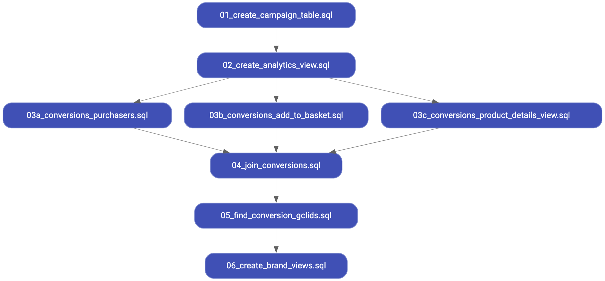

# Coop Analytics - Retailer Get Started

This guide explains how to get started with the code in this project as a
retailer.

The code in this project uses the [Google Analytics sample dataset for
BigQuery](https://support.google.com/analytics/answer/7586738?hl=en), as a proof
of concept. The scripts provided are examples and require modifying to work with
your data. Each script provides instructions in the header for the
modifications, alternatively continue reading for the full instructions.

## Overview

1. As the retailer, set up the [BigQuery export for Google Analytics 360](
   https://support.google.com/analytics/answer/3437618?hl=en) into a Google
   Cloud Project.

1. Modify the scripts in this project (more details below).

1. Schedule the scripts to run on a daily basis in the below execution order,
   see the scheduling section below for more details.

   

1. Share the final data with the brand:
    - The simplest solution is to create a separate BigQuery dataset that
     contains [a view of the brand's data](
     https://cloud.google.com/bigquery/docs/share-access-views), and share this
     with the brand. This project creates this data, but does not share the data
     with the brand.
   - Alternatively, [the data can be exported from BigQuery to Cloud Storage](
     https://cloud.google.com/bigquery/docs/exporting-data) and that shared with
     the brand.
   - Or there are other ETL alternatives that could be used, if there are other
     specific restrictions/requirements.

## SQL Scripts

The scripts by default create resources in a dataset called `coop_analytics`.
This dataset either needs to be created, or the scripts need to be modified to
write to a dataset name of your choice.

Below outlines the modifications required to each script:

- **01_create_campaign_table.sql**: creates a table containing the coop campaign
  agreements data. This majority of this script is an example, using product
  SKUs from the sample BQ dataset. Changes:
  - Clear all the sample data and replace this with the agreed UTM parameters, a
    unique campaign name, and the name of the brand.

- **02_create_analytics_view.sql**: creates a view of yesterday's Analytics
  export. Changes:
  - The sample dataset
    `bigquery-public-data.google_analytics_sample.ga_sessions_*` needs to be
    replaced with your Analytics dataset. Note the `*` at the end of the table,
    this needs to be present at the end of yours, as it is replaced in the WHERE
    clause using yesterday's date.
  - The WHERE clause needs updating to remove the hardcoded date example, and
    replaced with the commented out text.

- **03a_conversions_purchasers.sql**: creates a view of purchasers of the coop
  SKUs. No changes required.

- **03b_conversions_add_to_basket.sql**: creates a view of add to basket
  conversions of the coop SKUs. No changes required.

- **03c_conversions_product_details_view.sql**: creates a view of add to basket
  conversions of the coop SKUs. No changes required.

- **04_join_conversions.sql**: creates a view that combines all the conversion
  types into one consolidated view. Changes:
  - Remove any conversions types that are not relevant.

- **05_find_conversion_gclids.sql**: Creates a table containing a subset of the
  conversions which originated from the brands, containing only the GCLID,
  campaign ID & brand name (created in step 1), the type of conversion, the date
  time of the conversion, and the conversion value. Changes:
  - This script uses any click attribution, if this is not correct this script
    needs to be tweaked.
  - The FROM statement references the sample Analytics data
    `bigquery-public-data.google_analytics_sample.ga_sessions_*`. This needs to
    be replaced, again with the wildcard `*`.
  - The 90 in the WHERE condition is the number of days in the lookback window:
    `TIMESTAMP_SUB(Conversions.conversionDateTime, INTERVAL 90 DAY)` Change this
    to the appropriate value.
  - In the WHERE clause update `CustomDimension.index = 4` to the index of
    the custom dimension containing the GCLID.

- **06_create_brand_views.sql**: creates brand specific views of the data, so a
  brand can only view data that is to be shared with them. Changes:
  - Prior to running this script, the datasets need to created for each brand in
    BigQuery. An example from the code is:
    `global_brand_inc.CoopAnalyticConversions` where the `global_brand_inc`
    dataset needs to be created, with the intention of sharing this with Global
    Brand Inc. The idea is to share this view with the brand, [see docs](
    https://cloud.google.com/bigquery/docs/share-access-views). If you are
    uncomfortable using a VIEW, `CREATE OR REPLACE VIEW` can be swapped with
    `CREATE OR REPLACE TABLE` to create a copy of the data instead.

## Scheduling

[BigQuery supports scheduling queries](
https://cloud.google.com/bigquery/docs/scheduling-queries). This is the simplest
solution to scheduling. However, the Analytics transfer has no SLAs and is not
guaranteed to run by a certain time. If this scheduling is deployed, combine
all the SQL scripts into one query, and schedule the script towards the end of
the day.

For more advanced scheduling, [Pub/Sub](
https://cloud.google.com/pubsub/docs/overview) could be deployed to trigger a
[cloud function](https://cloud.google.com/functions) to orchestrate the SQL
scripts.

## Useful Links

- [The Analytics BigQuery Schema](
  https://support.google.com/analytics/answer/3437719?hl=en)
